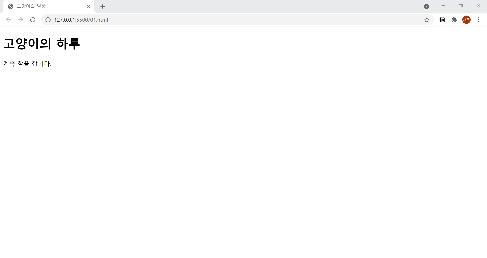

# 1. HTML 기본
  
```html
<!DOCTYPE html>
<html lang="en">
  
  <head>
    <meta charset="UTF-8">
  <title>고양이의 일상</title>
  <meta name="description" content="고양이가 좋아하는 것과 일상을 소개합니다.">
</head>

<body>
  <h1>고양이의 하루</h1>
  <p>계속 잠을 잡니다.</p>
</body>

</html>
```
1. `<!DOCTYPE html>` : HTML5 문서임을 정의
2. `<html>` : html 페이지의 루트
3. `<head>` : html 페이지에 대한 메타 정보(html 페이지를 설명해주는 부분)
4. `<title>` : html 페이지의 제목
5. `<body>` : html 페이지의 본문 