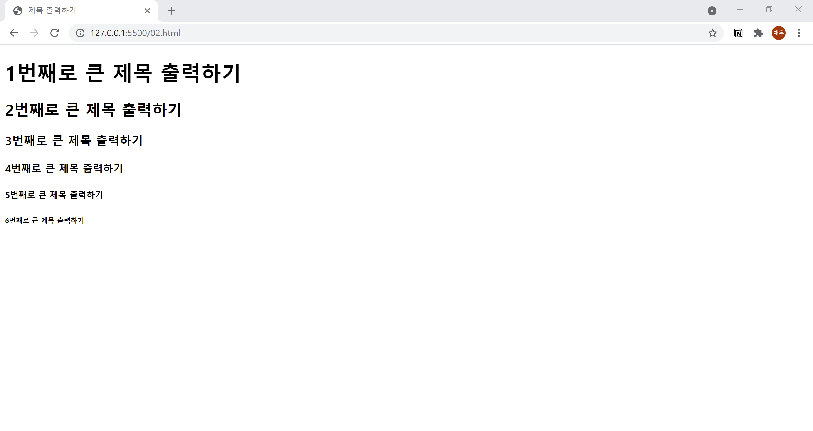

# 2. 제목 붙이기
- 제목은 `<h1> ~ <h6>` 태그를 사용해서 만듭니다.  


```html
<!DOCTYPE html>
<html lang="ko">

<head>
  <meta charset="UTF-8">
  <title>제목 출력하기</title>
  <meta name="description" content="제목 태그 h1~h6을 소개합니다.">
</head>

<body>
  <h1>1번째로 큰 제목 출력하기</h1>
  <h2>2번째로 큰 제목 출력하기</h2>
  <h3>3번째로 큰 제목 출력하기</h3>
  <h4>4번째로 큰 제목 출력하기</h4>
  <h5>5번째로 큰 제목 출력하기</h5>
  <h6>6번째로 큰 제목 출력하기</h6>
</body>

</html>
```