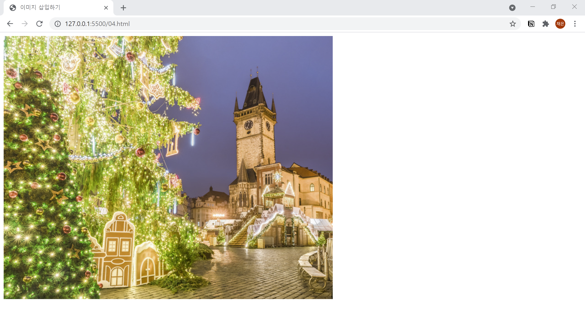

# 4. 이미지 삽입하기
- 이미지에는 `` 태그를 사용하며, 종료 태그가 없습니다.
- 출력할 이미지는 src 속성에서 설정합니다.
- alt 속성은 홈페이지에서 이미지를 제대로 출력하지 못할 때 이미지 대신 출력할 텍스트를 의미합니다.  
  

```html
<!DOCTYPE html>
<html lang="ko">

<head>
  <meta charset="UTF-8">
  <title>이미지 삽입하기</title>
  <meta name="description" content="이미지를 출력하는 img 태그를 소개합니다.">
</head>

<body>
  
</body>

</html>
```