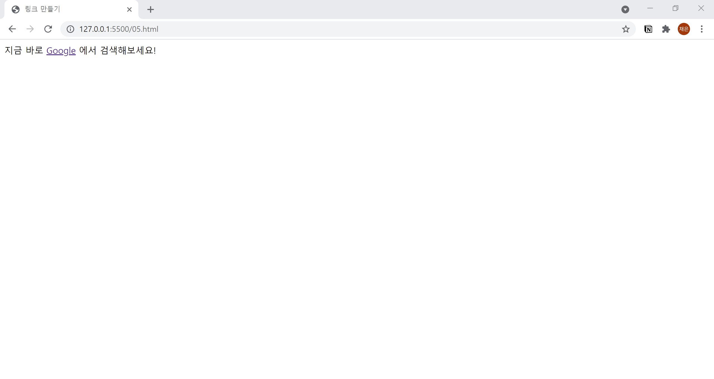

# 5. 링크 만들기
- 링크를 만들 때는 링크를 넣고 싶은 부분을 `<a href="">`와 `</a>` 태그 사이에 끼워 넣습니다.
- 링크 대상은 href 속성에 지정합니다.  
  

```html
<!DOCTYPE html>
<html lang="ko">

<head>
  <meta charset="UTF-8">
  <meta name="description" content="링크를 만드는 a 태그를 소개합니다.">
  <title>링크 만들기</title>
</head>

<body>
  지금 바로 <a href="https://www.google.co.kr/">Google</a> 에서 검색해보세요!
</body>

</html>
```