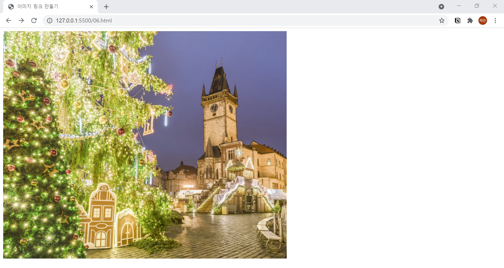

# 6. 이미지로 링크 만들기
- `` 태그를 `<a>` 태그로 감싸서 링크를 만듭니다. 
  

```html
<!DOCTYPE html>
<html lang="ko">

<head>
  <meta charset="UTF-8">
  <meta name="description" content="이미지 링크를 만듭니다.">
  <title>이미지 링크 만들기</title>
</head>

<body>
  <a href="https://www.google.co.kr/"></a>
</body>

</html>
```