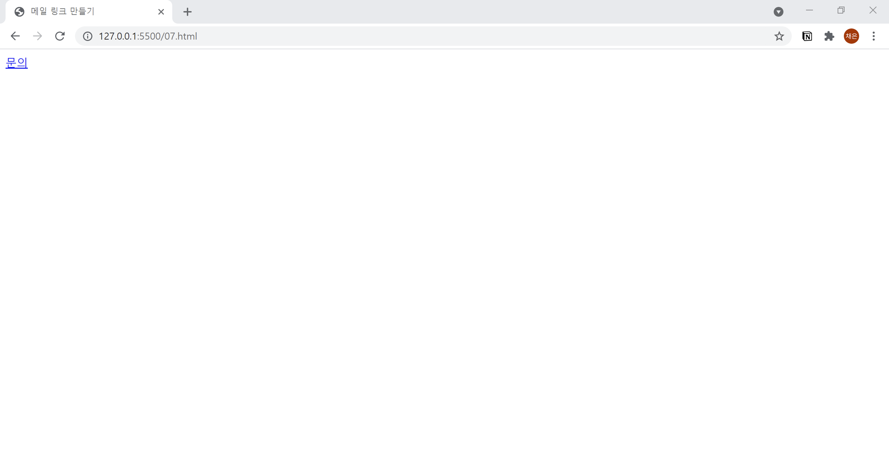

# 7. 메일 주소로 링크 만들기
- 메일 주소로 링크를 만들 때는 `<a>` 태그의 href 속성을 "**mailto:**" 라고 작성하고, 이어서 메일 주소를 넣어줍니다.  
  

```html
<!DOCTYPE html>
<html lang="ko">

<head>
  <meta charset="UTF-8">
  <meta name="description" content="메일 링크를 만듭니다.">
  <title>메일 링크 만들기</title>
</head>

<body>
  <a href="mailto:collcr@naver.com">문의</a>
</body>

</html>
```