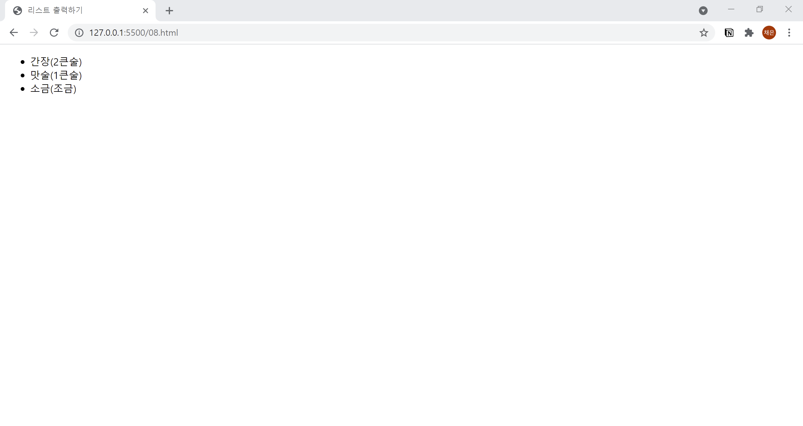

# 8. 기본적인 리스트 만들기
- 기본적인 리스트를 출력할 때에는 `<ul>` 태그를 사용합니다.
- `<ul>` 태그 내부에 `<li>` 태그를 사용해 항목을 추가합니다.  
  

```html
<!DOCTYPE html>
<html lang="ko">

<head>
  <meta charset="UTF-8">
  <meta name="description" content="기본적인 리스트를 만드는 ul태그 + li 태그">
  <title>리스트 출력하기</title>
</head>

<body>
  <ul>
    <li>간장(2큰술)</li>
    <li>맛술(1큰술)</li>
    <li>소금(조금)</li>
  </ul>
</body>

</html>
```