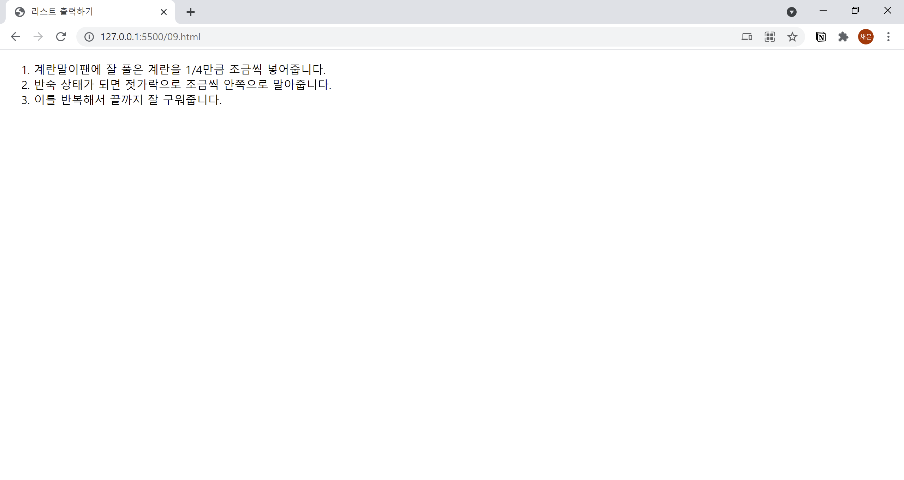

# 9. 순서 있는 리스트 만들기
- 번호가 붙어 있는 리스트를 만들 때에는 `<ol>` 태그를 사용합니다.
- `<ol>` 태그 내부에 `<li>` 태그를 사용해 항목을 추가합니다.  
  

```html
<!DOCTYPE html>
<html lang="ko">

<head>
  <meta charset="UTF-8">
  <meta name="description" content="순서 있는 리스트를 만드는 ol태그 + li태그">
  <title>리스트 출력하기</title>
</head>

<body>
  <ol>
    <li>계란말이팬에 잘 풀은 계란을 1/4만큼 조금씩 넣어줍니다.</li>
    <li>반숙 상태가 되면 젓가락으로 조금씩 안쪽으로 말아줍니다.</li>
    <li>이를 반복해서 끝까지 잘 구워줍니다.</li>
  </ol>
</body>

</html>
```