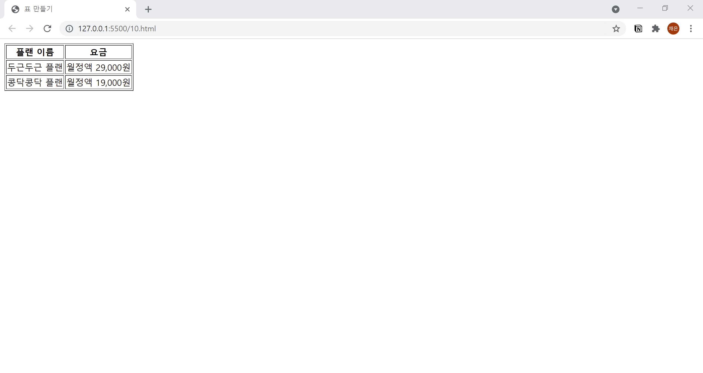

# 10. 표 만들기
- 표는 여러개의 태그를 조합해서 만듭니다.
- `<table>` : 표를 나타내는 태그
- `<tr>` : "Table Row" 의 약자로 표의 한 행을 나타냄. 
- `<th>` : "Table Header" 의 약자로 표의 제목 셀을 나타냄. 
- `<td>` : "Table Data" 의 약자로 표의 데이터 셀을 나타냄.
  

```html
<!DOCTYPE html>
<html lang="ko">

<head>
  <meta charset="UTF-8">
  <meta name="description" content="표 기본">
  <title>표 만들기</title>
</head>

<body>
  <table border="1">
    <tr>
      <th>플랜 이름</th><th>요금</th>
    </tr>
    <tr>
      <td>두근두근 플랜</td><td>월정액 29,000원</td>
    </tr>
    <tr>
      <td>콩닥콩닥 플랜</td><td>월정액 19,000원</td>
    </tr>
  </table>
</body>

</html>
```