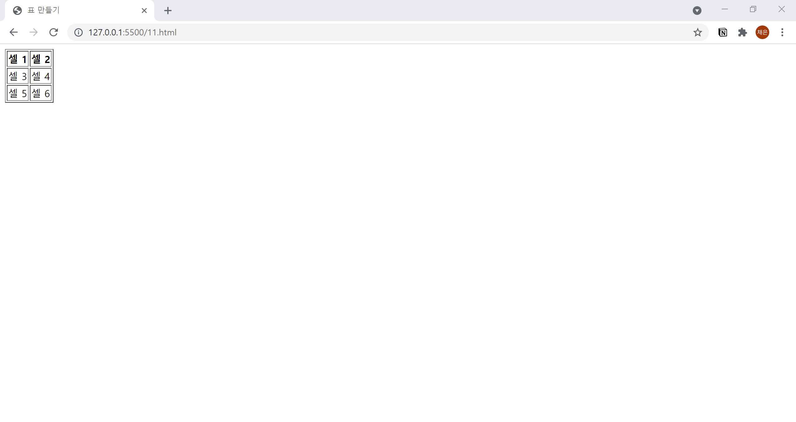

# 11. 기본이 되는 표 만들기
- 기본이 되는 표를 만들어 봅시다.
  

```html
<!DOCTYPE html>
<html lang="ko">

<head>
  <meta charset="UTF-8">
  <meta name="description" content="셀 연결하기">
  <title>표 만들기</title>
</head>

<body>
  <table border="1">
    <tr>
      <th>셀 1</th><th>셀 2</th>
    </tr>
    <tr>
      <td>셀 3</td><td>셀 4</td>
    </tr>
    <tr>
      <td>셀 5</td><td>셀 6</td>
    </tr>
  </table>
</body>

</html>
```