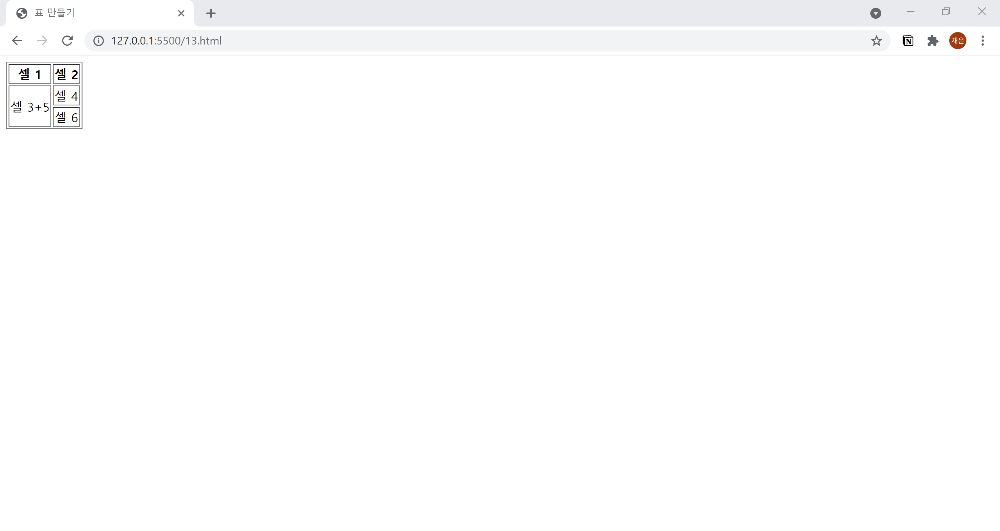

# 13. 수직 방향으로 병합하기
- `<th>` 또는 `<td>` 태그에 **rowspan** 속성을 추가하여 병합하고 싶은 셀의 수를 작성합니다.
  

```html
<!DOCTYPE html>
<html lang="ko">

<head>
  <meta charset="UTF-8">
  <meta name="description" content="세로 방향으로 연결하기">
  <title>표 만들기</title>
</head>

<body>
  <table border="1">
    <tr>
      <th>셀 1</th><th>셀 2</th>
    </tr>
    <tr>
      <td rowspan="2">셀 3+5</td><td>셀 4</td>
    </tr>
    <tr>
      <td>셀 6</td>
    </tr>
  </table>
</body>

</html>
```