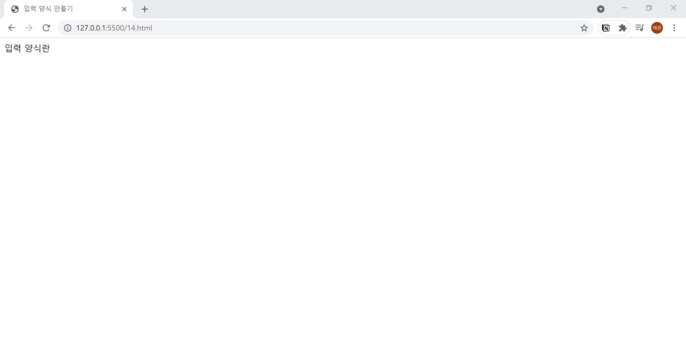

# 14. 입력 양식란 만들기
- `<form>` 태그는 입력 양식을 만들기 위한 태그이며, 입력 양식에서 사용하는 모든 부품은 `<form>` 태그 내부에 넣어줍니다.
- action : 데이터의 전송 대상 페이지 지정
- method : 데이터 전송 방법 
- name : 입력 양식의 이름  
  

```html
<!DOCTYPE html>
<html lang="ko">

<head>
  <meta charset="UTF-8">
  <meta name="description" content="입력 양식란을 만드는 form 태그">
  <title>입력 양식 만들기</title>
</head>

<body>
  <form action="example.php" method="post" name="contact-form">
    입력 양식란
  </form>
</body>

</html>
```