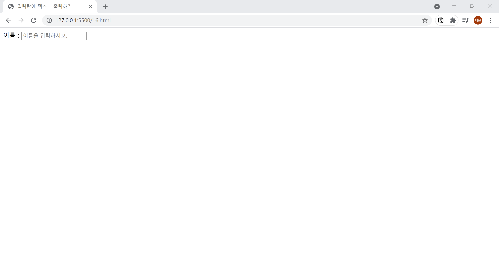

# 16. 입력란에 텍스트 출력하기
- **placeholder** 속성을 사용하여 입력란에 미리 텍스트를 출력합니다.
  

```html
<!DOCTYPE html>
<html lang="ko">

<head>
  <meta charset="UTF-8">
  <meta name="description" content="입력란에 처음부터 텍스트 출력하기">
  <title>입력란에 텍스트 출력하기</title>
</head>

<body>
  <form action="example.php" method="post" name="contact-form">
    이름 : <input type="text" placeholder="이름을 입력하시오.">
  </form>
</body>

</html>
```