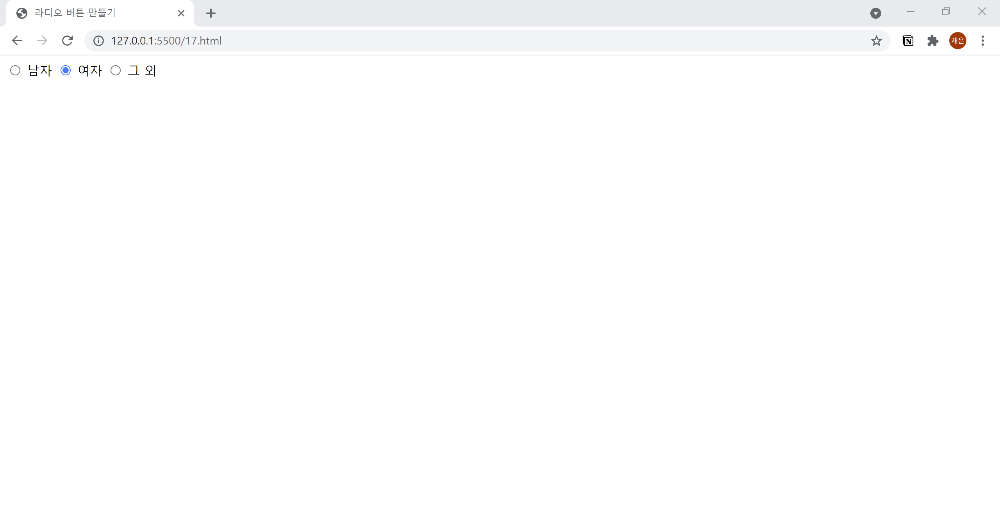

# 17. 라디오 버튼 만들기
- **radio** 속성을 사용하여 라디오 버튼을 생성합니다.
- name : 라디오 버튼의 이름
- value : 전송된 선택지의 값
- checked : 처음부터 선택되게 하고 싶을 때 지정  
  

```html
<!DOCTYPE html>
<html lang="ko">

<head>
  <meta charset="UTF-8">
  <meta name="description" content="라디오 버튼 만들기">
  <title>라디오 버튼 만들기</title>
</head>

<body>
  <form action="example.php" method="post" name="contact-form">
    <input type="radio" value="남자" name="gender"> 남자
    <input type="radio" value="여자" name="gender" checked> 여자
    <input type="radio" value="그외" name="gender"> 그 외
  </form>
</body>

</html>
```