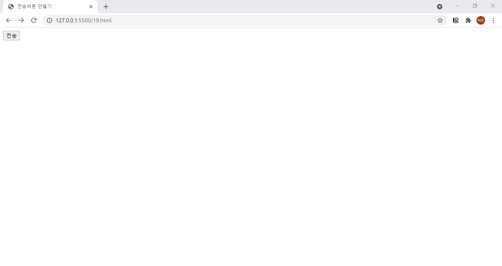

# 19. 전송버튼 만들기
- **submit** 속성을 사용하여 입력 양식에 입력한 내용을 전송합니다.
- name : 버튼의 이름
- value : 버튼에 출력되는 글자   
  

```html
<!DOCTYPE html>
<html lang="ko">

<head>
  <meta charset="UTF-8">
  <meta name="description" content="전송버튼 만들기">
  <title>전송버튼 만들기</title>
</head>

<body>
  <form action="example.php" method="post" name="contact-form">
    <input type="submit" name="send" value="전송">
  </form>
</body>
</html>
```