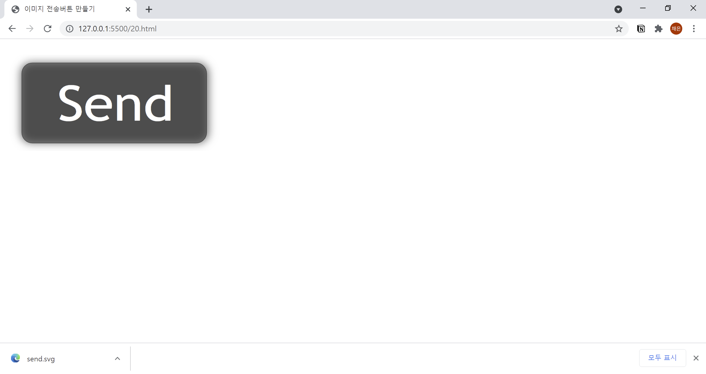

# 20. 전송버튼에 이미지 사용하기
- **image** 속성을 사용하여 전송 버튼에 이미지를 사용합니다.
- name : 버튼의 이름
- src : 이미지 경로
- alt : 이미지를 설명하는 글자  
  

```html
<!DOCTYPE html>
<html lang="ko">

<head>
  <meta charset="UTF-8">
  <meta name="description" content="이미지 전송버튼 만들기">
  <title>이미지 전송버튼 만들기</title>
</head>

<body>
  <form action="example.php" method="post" name="contact-form">
    <input type="image" src="img/send.svg" alt="전송">
  </form>
</body>

</html>
```