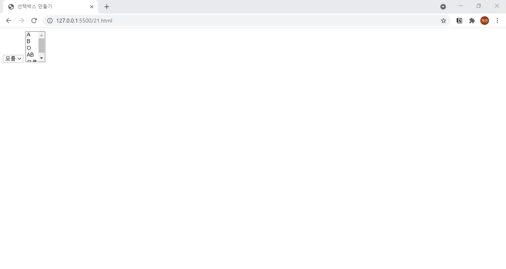

# 21. 선택박스 만들기
- 선택지 전체를 `<select>` 태그로 감싸고, 선택 항목을 `<option>` 태그로 각각 감싸줍니다.
- name : 버튼의 이름
- multiple : shift 또는 ctrl 키로 여러 항목을 선택할 수 있게 됩니다.
- value : 전송될 선택지의 값
- selected : 처음부터 항목이 선택되게 하고 싶을 때 지정
  

```html
<!DOCTYPE html>
<html lang="ko">

<head>
  <meta charset="UTF-8">
  <meta name="description" content="선택박스 만들기">
  <title>선택박스 만들기</title>
</head>

<body>
  <form action="example.php" method="post" name="contact-form">
    <select name="bloodtype" id="">
      <option value="A">A</option>
      <option value="B">B</option>
      <option value="O">O</option>
      <option value="AB">AB</option>
      <option value="모름" selected>모름</option>
    </select>
    <select name="bloodtype" id="" multiple>
      <option value="A">A</option>
      <option value="B">B</option>
      <option value="O">O</option>
      <option value="AB">AB</option>
      <option value="모름">모름</option>
    </select>
  </form>
</body>

</html>
```