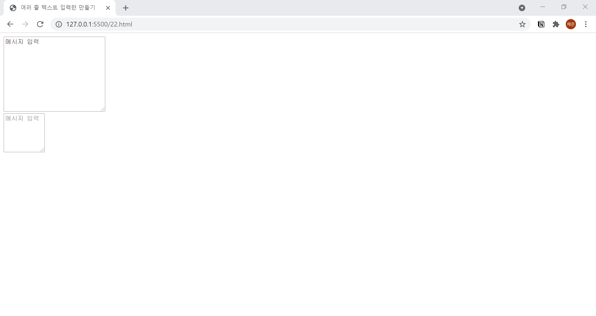

# 22. 여러 줄 텍스트 입력란 만들기
- `<textarea>`태그를 사용하면 여러 줄의 텍스트를 입력할 수 있습니다.
- `<textarea>` 태그로 감싼 부분이 초깃값으로 출력됩니다.
- **placeholder** 속성을 사용하면 텍스트 입력란에 처음부터 텍스트가 출력됩니다.
  

```html
<!DOCTYPE html>
<html lang="ko">

<head>
  <meta charset="UTF-8">
  <meta name="description" content="여러 줄 텍스트 입력란 만들기">
  <title>여러 줄 텍스트 입력란 만들기</title>
</head>

<body>
  <form action="example.php" method="post" name="contact-form">
    <textarea name="message" id="" cols="30" rows="10">메시지 입력</textarea>
  </form>
  <form action="example.php" method="post" name="contact-form">
    <textarea name="message" id="" cols="10" rows="5" placeholder="메시지 입력"></textarea>
  </form>
</body>

</html>
```