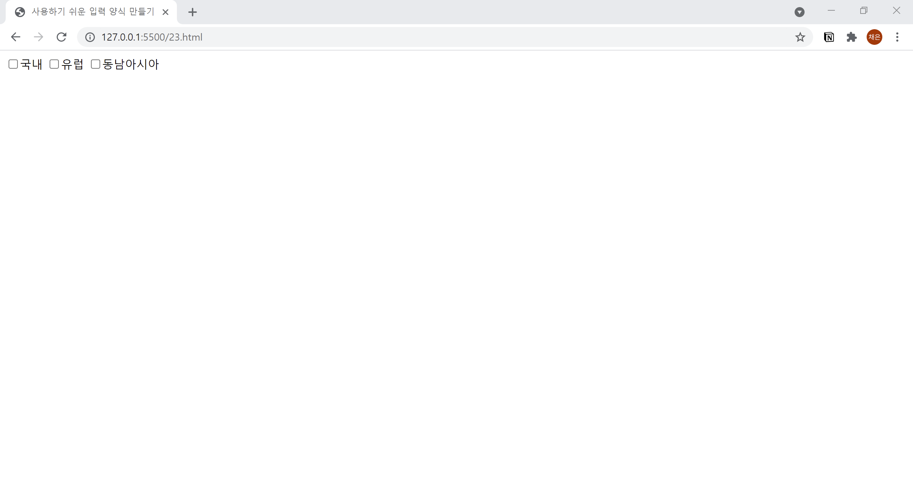

# 23. 사용하기 쉬운 입력 양식 만들기
- 사용자에 따라 라디오 버튼, 체크 박스를 클릭하는 것이 힘들 수 있으므로, `<label>` 태그를 사용하여 클릭을 쉽게 할 수 있게 해줍니다.
- `<label>` 태그의 **for** 속성을 `<input>` 태그의 **id** 속성으로 합니다.
  

```html
<!DOCTYPE html>
<html lang="ko">

<head>
  <meta charset="UTF-8">
  <meta name="description" content="사용하기 쉬운 입력 양식 만들기">
  <title>사용하기 쉬운 입력 양식 만들기</title>
</head>

<body>
  <form action="example.php" mtehod="post" name="contact-form">
    <input type="checkbox" name="travel" value="국내" id="korea"><label for="korea">국내</label>
    <input type="checkbox" name="travel" value="유럽" id="europe"><label for="korea">유럽</label>
    <input type="checkbox" name="travel" value="동남아시아" id="asia"><label for="korea">동남아시아</label>
  </form>
</body>

</html>
```