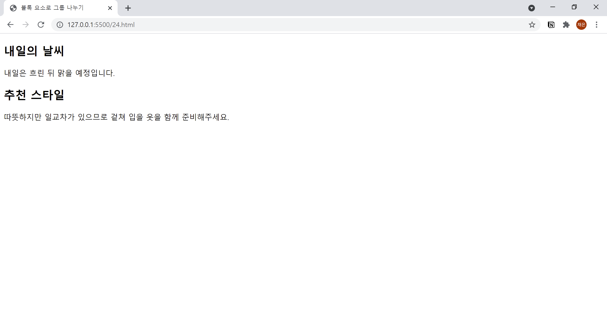

# 24. 그룹을 구분하기 위한 태그 사용하기
- `<article>`, `<section>` 등의 태그를 사용해서 그룹을 나눌 수 있습니다.
- HTML만으로는 출력에 변화가 없지만, CSS를 사용하면 그룹별로 색상을 적용하거나 레이아웃을 변경할 수 있습니다.
  

```html
<!DOCTYPE html>
<html lang="ko">

<head>  
  <meta charset="UTF-8">
  <meta name="description" content="그룹 나누기">
  <title>블록 요소로 그룹 나누기</title>
</head>

<body>
  <article>
    <h1>내일의 날씨</h1>
    <p>내일은 흐린 뒤 맑을 예정입니다.</p>
  </article>
  <section>
    <h2>추천 스타일</h2>
    <p>따뜻하지만 일교차가 있으므로 겉쳐 입을 옷을 함께 준비해주세요.</p>
  </section>
</body>

</html>
```